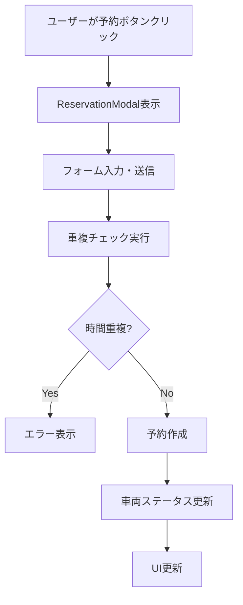
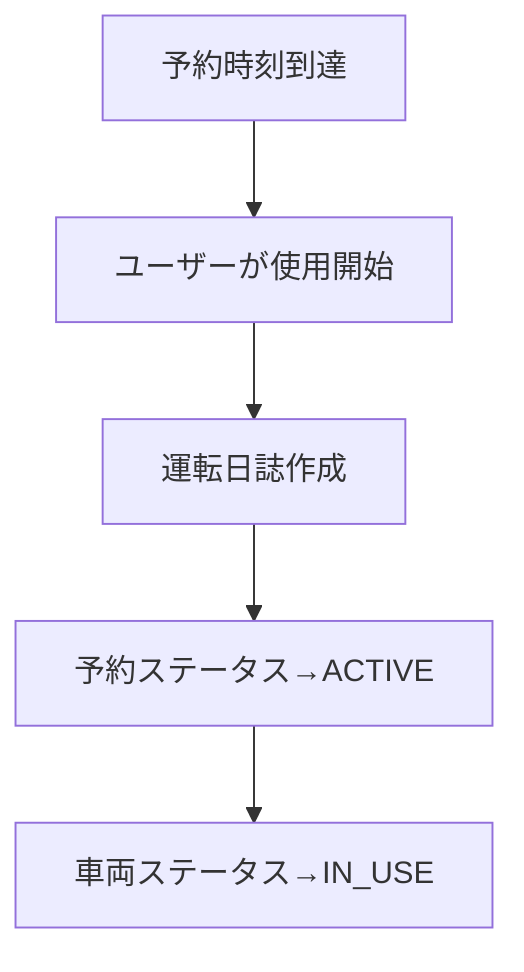

# 車両予約システム改善計画

## 📋 概要

現在の公用車管理システムに適切な予約機能を追加し、時間帯管理とステータス管理を改善するためのドキュメントです。

### 改善の背景

- **現在の課題**: 予約機能が未実装（ボタンは存在するが機能しない）
- **ビジネス要件**: 将来の予約、時間帯重複防止、適切なステータス管理
- **技術的課題**: DrivingLogが予約と実際の運転記録を兼ねている設計

### 期待される成果

- ✅ 適切な予約システムの実現
- ✅ 時間帯管理の正確性向上
- ✅ ユーザビリティの大幅改善
- ✅ 将来拡張性の確保

---

## 🔍 現在の状況分析

### 実装済み機能
- ✅ 車両一覧表示（完全動作）
- ✅ 使用中車両表示（完全動作）
- ✅ 統計データ表示（完全動作）
- ✅ ステータス別表示（完全動作）

### 未実装機能
- ❌ 予約ボタン機能（見た目のみ）
- ❌ 予約モーダル（存在しない）
- ❌ 予約管理システム（完全に未実装）

### 技術スタック
- **フロントエンド**: Next.js 15.4.6, React 19.1.0, TypeScript
- **バックエンド**: Prisma ORM, PostgreSQL
- **UI**: Tailwind CSS, Radix UI components
- **フォーム**: React Hook Form + Zod（新規導入済み）

---

## 🎯 新しいDB設計

### 設計方針
1. **責任の分離**: 予約管理と運転記録を完全分離
2. **後方互換性**: 既存機能を壊さない
3. **段階的移行**: リスクを最小化

### 新しいスキーマ

#### 1. 予約ステータス（新規）
```prisma
enum ReservationStatus {
  PENDING    // 予約確定、使用開始待ち
  ACTIVE     // 現在使用中
  COMPLETED  // 使用完了
  CANCELLED  // キャンセル済み
}
```

#### 2. 車両ステータス（拡張）
```prisma
enum VehicleStatus {
  AVAILABLE   // 利用可能
  RESERVED    // 予約済み（複数予約可能）← 新規追加
  IN_USE      // 実際に使用中（1台につき1つのみ）
  MAINTENANCE // 点検中
}
```

#### 3. 予約管理テーブル（新規）
```prisma
model Reservation {
  id          String            @id @default(cuid())
  start_time  DateTime          // 予約開始時刻
  end_time    DateTime          // 予約終了時刻
  purpose     String?           // 利用目的・行き先
  status      ReservationStatus @default(PENDING)
  created_at  DateTime          @default(now())
  updated_at  DateTime          @updatedAt
  
  // 外部キー
  user_id     String
  vehicle_id  String
  
  // リレーション
  user        User              @relation(fields: [user_id], references: [id])
  vehicle     Vehicle           @relation(fields: [vehicle_id], references: [id])
  driving_log DrivingLog?       // 1対1（任意）：予約→運転記録の変換
  
  // 重複防止用インデックス
  @@index([vehicle_id, start_time, end_time])
  @@map("reservations")
}
```

#### 4. 運転日誌テーブル（軽微修正）
```prisma
model DrivingLog {
  // 既存フィールドはすべて維持
  id             String    @id @default(cuid())
  start_time     DateTime  // 運転開始時刻
  end_time       DateTime? // 運転終了時刻（任意）
  start_meter    Int?      // 開始時メーター（任意）
  end_meter      Int?      // 終了時メーター（任意）
  destination    String?   // 行き先
  is_refueling   Boolean   @default(false) // 給油有無
  notes          String?   // 備考（任意）
  created_at     DateTime  @default(now())
  updated_at     DateTime  @updatedAt
  
  // 外部キー（既存）
  vehicle_id     String
  user_id        String
  
  // 新規追加（任意）
  reservation_id String?   @unique
  
  // リレーション
  vehicle        Vehicle      @relation(fields: [vehicle_id], references: [id])
  user           User         @relation(fields: [user_id], references: [id])
  reservation    Reservation? @relation(fields: [reservation_id], references: [id])
  
  @@map("driving_logs")
}
```

### データフロー設計

#### 予約作成フロー


#### 使用開始フロー


---

## 🚀 実装計画

### Phase 1: データ基盤構築（2-3日）

#### 1.1 Prismaスキーマ更新
```bash
# ファイル: prisma/schema.prisma
# 作業: ReservationStatus, Reservation model, VehicleStatus拡張を追加
```

**具体的な作業:**
1. `ReservationStatus` enum追加
2. `VehicleStatus` に `RESERVED` 追加
3. `Reservation` model追加
4. `DrivingLog` に `reservation_id` 追加

#### 1.2 マイグレーション実行
```bash
# データベースバックアップ（必須）
pg_dump your_database > backup_before_reservation_migration.sql

# マイグレーション生成・実行
npx prisma migrate dev --name add_reservation_system
```

#### 1.3 シードデータ調整
```typescript
// ファイル: prisma/seed.ts
// 作業: 予約データのサンプルを追加

const reservationData: Prisma.ReservationCreateInput[] = [
  {
    start_time: new Date("2025-08-19T10:00:00"),
    end_time: new Date("2025-08-19T15:00:00"),
    purpose: "東京駅での会議",
    status: "PENDING",
    user: { connect: { email: "sato.hanako@company.com" } },
    vehicle: { connect: { license_plate: "品川 500 あ 1234" } }
  },
  // 他のサンプル予約データ
];
```

#### 1.4 型定義更新
```typescript
// ファイル: src/types/vehicle.ts
// 作業: Reservation型、ReservationStatus型を追加

export interface Reservation {
  id: string;
  startTime: string;
  endTime: string;
  purpose?: string;
  status: ReservationStatus;
  userId: string;
  vehicleId: string;
  user?: User;
  vehicle?: Vehicle;
}

export type ReservationStatus = "PENDING" | "ACTIVE" | "COMPLETED" | "CANCELLED";
```

**検証ポイント:**
- [ ] マイグレーション成功
- [ ] シード実行成功
- [ ] 型エラーなし
- [ ] 既存機能が正常動作

---

### Phase 2: バックエンドAPI実装（3-4日）

#### 2.1 予約管理Actions
```typescript
// ファイル: src/lib/actions/reservation-actions.ts（新規作成）

"use server";

import { revalidatePath } from "next/cache";
import { reservationSchema } from "@/lib/schemas/reservation";
import prisma from "@/lib/prisma";

export async function createReservationAction(formData: FormData) {
  // 1. バリデーション
  const validatedFields = reservationSchema.safeParse({
    vehicleId: formData.get("vehicleId"),
    startDateTime: formData.get("startDateTime"),
    endDateTime: formData.get("endDateTime"),
    purpose: formData.get("purpose"),
  });

  if (!validatedFields.success) {
    return {
      error: "入力内容を確認してください",
      details: validatedFields.error.format(),
    };
  }

  // 2. 重複チェック
  const conflicts = await checkTimeConflicts(
    validatedFields.data.vehicleId,
    validatedFields.data.startDateTime,
    validatedFields.data.endDateTime
  );

  if (conflicts.length > 0) {
    return {
      error: "選択した時間帯は既に予約されています",
      conflicts,
    };
  }

  try {
    // 3. 予約作成
    await prisma.$transaction(async (tx) => {
      const reservation = await tx.reservation.create({
        data: {
          vehicle_id: validatedFields.data.vehicleId,
          user_id: "user_id_here", // 実際の認証から取得
          start_time: validatedFields.data.startDateTime,
          end_time: validatedFields.data.endDateTime,
          purpose: validatedFields.data.purpose,
        },
      });

      // 4. 車両ステータス更新
      await updateVehicleStatus(validatedFields.data.vehicleId, tx);
    });

    revalidatePath("/");
    return { success: true };
  } catch (error) {
    console.error("Reservation creation failed:", error);
    return { error: "予約に失敗しました。再度お試しください。" };
  }
}
```

#### 2.2 重複チェック機能
```typescript
// ファイル: src/lib/utils/reservation-utils.ts（新規作成）

import prisma from "@/lib/prisma";

export async function checkTimeConflicts(
  vehicleId: string,
  startTime: Date,
  endTime: Date
): Promise<Reservation[]> {
  return await prisma.reservation.findMany({
    where: {
      vehicle_id: vehicleId,
      status: {
        in: ["PENDING", "ACTIVE"], // 有効な予約のみ
      },
      OR: [
        // 開始時刻が既存予約の期間内
        {
          AND: [
            { start_time: { lte: startTime } },
            { end_time: { gt: startTime } },
          ],
        },
        // 終了時刻が既存予約の期間内
        {
          AND: [
            { start_time: { lt: endTime } },
            { end_time: { gte: endTime } },
          ],
        },
        // 既存予約が新予約の期間内
        {
          AND: [
            { start_time: { gte: startTime } },
            { end_time: { lte: endTime } },
          ],
        },
      ],
    },
    include: {
      user: true,
    },
  });
}
```

#### 2.3 車両状態管理
```typescript
// ファイル: src/lib/utils/vehicle-status.ts（新規作成）

export async function updateVehicleStatus(
  vehicleId: string, 
  tx?: PrismaTransactionClient
) {
  const prismaClient = tx || prisma;

  // 現在時刻で有効な予約をチェック
  const activeReservation = await prismaClient.reservation.findFirst({
    where: {
      vehicle_id: vehicleId,
      status: "ACTIVE",
    },
  });

  // 将来の予約をチェック
  const futureReservations = await prismaClient.reservation.findMany({
    where: {
      vehicle_id: vehicleId,
      status: "PENDING",
      start_time: { gt: new Date() },
    },
  });

  // ステータス決定ロジック
  let newStatus: VehicleStatus;
  if (activeReservation) {
    newStatus = "IN_USE";
  } else if (futureReservations.length > 0) {
    newStatus = "RESERVED";
  } else {
    newStatus = "AVAILABLE";
  }

  // 車両ステータス更新
  await prismaClient.vehicle.update({
    where: { id: vehicleId },
    data: { status: newStatus },
  });
}
```

#### 2.4 データ取得関数拡張
```typescript
// ファイル: src/lib/data.ts に追加

export async function getReservations(userId?: string): Promise<Reservation[]> {
  const where = userId ? { user_id: userId } : {};
  
  const reservations = await prisma.reservation.findMany({
    where,
    include: {
      user: true,
      vehicle: true,
    },
    orderBy: { start_time: "asc" },
  });

  return reservations.map(dbToFrontendReservation);
}

export async function getVehicleSchedule(vehicleId: string, date: Date) {
  const startOfDay = new Date(date);
  startOfDay.setHours(0, 0, 0, 0);
  
  const endOfDay = new Date(date);
  endOfDay.setHours(23, 59, 59, 999);

  return await prisma.reservation.findMany({
    where: {
      vehicle_id: vehicleId,
      start_time: { gte: startOfDay },
      end_time: { lte: endOfDay },
      status: { in: ["PENDING", "ACTIVE"] },
    },
    include: { user: true },
    orderBy: { start_time: "asc" },
  });
}
```

**検証ポイント:**
- [ ] 重複チェック機能動作
- [ ] 予約作成API動作
- [ ] 車両ステータス更新正常
- [ ] エラーハンドリング適切

---

### Phase 3: フロントエンド実装（4-5日）

#### 3.1 予約モーダルコンポーネント
```typescript
// ファイル: src/app/components/ReservationModal.tsx（新規作成）

"use client";

import { useForm } from "react-hook-form";
import { zodResolver } from "@hookform/resolvers/zod";
import { reservationSchema, type ReservationFormData } from "@/lib/schemas/reservation";
import { createReservationAction } from "@/lib/actions/reservation-actions";
import { SimpleModal } from "./SimpleModal";
import { Input } from "@/components/ui/input";
import { Label } from "@/components/ui/label";
import { Button } from "@/components/ui/button";

interface ReservationModalProps {
  vehicle: Vehicle;
  isOpen: boolean;
  onClose: () => void;
}

export function ReservationModal({ vehicle, isOpen, onClose }: ReservationModalProps) {
  const {
    register,
    handleSubmit,
    formState: { errors, isSubmitting },
    reset,
    setError,
  } = useForm<ReservationFormData>({
    resolver: zodResolver(reservationSchema),
  });

  const onSubmit = async (data: ReservationFormData) => {
    const formData = new FormData();
    formData.append("vehicleId", vehicle.id);
    formData.append("startDateTime", data.startDateTime);
    formData.append("endDateTime", data.endDateTime);
    if (data.purpose) formData.append("purpose", data.purpose);

    const result = await createReservationAction(formData);

    if (result.success) {
      reset();
      onClose();
      // 成功通知（後で実装）
    } else if (result.conflicts) {
      setError("startDateTime", {
        message: `${result.conflicts[0].start_time} - ${result.conflicts[0].end_time} に予約済み`,
      });
    } else {
      // エラー処理
      console.error(result.error);
    }
  };

  return (
    <SimpleModal
      isOpen={isOpen}
      onClose={onClose}
      title={`車両予約 - ${vehicle.licensePlate}`}
    >
      <form onSubmit={handleSubmit(onSubmit)} className="space-y-6">
        {/* 車両情報表示 */}
        <div className="bg-gray-50 p-4 rounded-xl">
          <p className="text-sm font-medium text-gray-700">
            {vehicle.make} {vehicle.model} ({vehicle.year}年)
          </p>
        </div>

        {/* 開始日時 */}
        <div>
          <Label htmlFor="startDateTime">利用開始日時</Label>
          <Input
            id="startDateTime"
            type="datetime-local"
            {...register("startDateTime")}
            className={errors.startDateTime ? "border-red-500" : ""}
          />
          {errors.startDateTime && (
            <p className="text-red-500 text-sm mt-1">{errors.startDateTime.message}</p>
          )}
        </div>

        {/* 終了日時 */}
        <div>
          <Label htmlFor="endDateTime">利用終了日時</Label>
          <Input
            id="endDateTime"
            type="datetime-local"
            {...register("endDateTime")}
            className={errors.endDateTime ? "border-red-500" : ""}
          />
          {errors.endDateTime && (
            <p className="text-red-500 text-sm mt-1">{errors.endDateTime.message}</p>
          )}
        </div>

        {/* 利用目的 */}
        <div>
          <Label htmlFor="purpose">利用目的（任意）</Label>
          <textarea
            id="purpose"
            rows={3}
            placeholder="会議、営業訪問、その他業務など..."
            {...register("purpose")}
            className="w-full border-0 bg-gray-50 rounded-xl px-4 py-3 text-sm focus:ring-2 focus:ring-purple-500 focus:bg-white transition-all shadow-sm resize-none"
          />
          {errors.purpose && (
            <p className="text-red-500 text-sm mt-1">{errors.purpose.message}</p>
          )}
        </div>

        {/* ボタン */}
        <div className="flex justify-end space-x-4">
          <Button type="button" variant="outline" onClick={onClose}>
            キャンセル
          </Button>
          <Button type="submit" disabled={isSubmitting}>
            {isSubmitting ? "予約中..." : "予約確定"}
          </Button>
        </div>
      </form>
    </SimpleModal>
  );
}
```

#### 3.2 VehicleRow修正
```typescript
// ファイル: src/app/components/VehicleRow.tsx
// 変更: statusConfigにRESERVED追加、予約ボタンに機能追加

"use client";

import { useState } from "react";
import { Button } from "@/components/ui/button.tsx";
import type { StatusConfig, Vehicle } from "@/types/vehicle.ts";
import { ReservationModal } from "./ReservationModal";

// ステータス設定（RESERVED追加）
const statusConfig: Record<string, StatusConfig> = {
  available: {
    label: "利用可能",
    bgGradient: "from-blue-100 to-cyan-100",
    textColor: "text-blue-700",
    buttonDisabled: false,
  },
  reserved: { // 新規追加
    label: "予約済み",
    bgGradient: "from-yellow-100 to-amber-100",
    textColor: "text-yellow-700",
    buttonDisabled: false, // 予約可能（複数予約対応）
  },
  "in-use": {
    label: "使用中",
    bgGradient: "from-pink-100 to-rose-100",
    textColor: "text-pink-700",
    buttonDisabled: true,
  },
  maintenance: {
    label: "点検中",
    bgGradient: "from-orange-100 to-red-100",
    textColor: "text-orange-700",
    buttonDisabled: true,
  },
};

interface VehicleRowProps {
  vehicle: Vehicle;
}

export const VehicleRow = ({ vehicle }: VehicleRowProps) => {
  const [isModalOpen, setIsModalOpen] = useState(false);
  const IconComponent = vehicle.icon;
  const status = statusConfig[vehicle.status];

  return (
    <>
      <tr className="hover:bg-white/80 transition-all duration-200">
        {/* 既存のtdコンテンツは変更なし */}
        <td className="px-8 py-6 whitespace-nowrap">
          {/* 車両情報 */}
        </td>
        <td className="px-8 py-6 whitespace-nowrap">
          {/* ステータス表示 */}
        </td>
        <td className="px-8 py-6 whitespace-nowrap text-sm text-gray-600 font-medium">
          {/* 現在の利用者 */}
        </td>
        <td className="px-8 py-6 whitespace-nowrap text-sm text-gray-600 font-medium">
          {/* 次回点検日 */}
        </td>
        
        {/* 操作列 - 予約ボタンに機能追加 */}
        <td className="px-8 py-6 whitespace-nowrap text-sm font-medium space-x-3">
          <Button
            className={`px-4 py-2 rounded-xl transition-all shadow-md ${
              status.buttonDisabled
                ? "bg-gray-200 text-gray-400 cursor-not-allowed"
                : "bg-gradient-to-r from-purple-600 to-indigo-700 hover:from-purple-700 hover:to-indigo-800 text-white hover:shadow-lg transform hover:scale-105"
            }`}
            disabled={status.buttonDisabled}
            onClick={() => setIsModalOpen(true)} // 機能追加
          >
            予約
          </Button>
          <Button className="bg-gray-100 hover:bg-gray-200 text-gray-700 px-4 py-2 rounded-xl transition-all shadow-md hover:shadow-lg">
            詳細
          </Button>
        </td>
      </tr>

      {/* 予約モーダル */}
      <ReservationModal
        vehicle={vehicle}
        isOpen={isModalOpen}
        onClose={() => setIsModalOpen(false)}
      />
    </>
  );
};
```

#### 3.3 統計データ更新
```typescript
// ファイル: src/lib/data.ts
// getVehicleStats関数を修正

export async function getVehicleStats(): Promise<{
  total: number;
  available: number;
  reserved: number; // 新規追加
  inUse: number;
  maintenance: number;
}> {
  try {
    const total = await prisma.vehicle.count();
    const available = await prisma.vehicle.count({
      where: { status: "AVAILABLE" },
    });
    const reserved = await prisma.vehicle.count({ // 新規追加
      where: { status: "RESERVED" },
    });
    const inUse = await prisma.vehicle.count({
      where: { status: "IN_USE" },
    });
    const maintenance = await prisma.vehicle.count({
      where: { status: "MAINTENANCE" },
    });

    return { total, available, reserved, inUse, maintenance };
  } catch (error) {
    console.error("Error fetching vehicle stats:", error);
    throw new Error("Failed to fetch vehicle stats");
  }
}
```

**検証ポイント:**
- [ ] 予約モーダル表示・非表示
- [ ] フォームバリデーション動作
- [ ] 重複エラー表示
- [ ] 予約成功時のUI更新
- [ ] 新しいステータス表示

---

### Phase 4: 統合・テスト（2-3日）

#### 4.1 エンドツーエンドテスト

**テストシナリオ:**

1. **正常予約フロー**
   - 利用可能車両で予約ボタンクリック
   - 適切な日時を入力して予約確定
   - 車両ステータスがRESERVEDに変更されることを確認
   - 統計データが更新されることを確認

2. **重複予約テスト**
   - 既存予約と重複する時間で予約を試行
   - 適切なエラーメッセージが表示されることを確認

3. **使用開始フロー**（将来の機能）
   - 予約時刻到達時の動作確認
   - ステータス遷移の確認

#### 4.2 パフォーマンステスト

```typescript
// 重複チェッククエリの最適化確認
// インデックス効果の検証
// 大量データでのレスポンス時間測定
```

#### 4.3 データ整合性チェック

```sql
-- 予約の重複チェック
SELECT 
  r1.id, r1.vehicle_id, r1.start_time, r1.end_time,
  r2.id, r2.start_time, r2.end_time
FROM reservations r1
JOIN reservations r2 ON (
  r1.vehicle_id = r2.vehicle_id 
  AND r1.id != r2.id
  AND r1.status IN ('PENDING', 'ACTIVE')
  AND r2.status IN ('PENDING', 'ACTIVE')
  AND (
    (r1.start_time < r2.end_time AND r1.end_time > r2.start_time)
  )
);
```

**検証ポイント:**
- [ ] 全機能の統合動作確認
- [ ] パフォーマンス要件達成
- [ ] データ整合性保証
- [ ] エラー処理の完全性

---

## 📊 リスク管理

### 高リスク項目

1. **データ移行**
   - **リスク**: 既存の進行中DrivingLogデータの整合性
   - **対策**: 段階的移行、完全バックアップ、ロールバック準備

2. **時間帯重複ロジック**
   - **リスク**: 複雑な重複判定ロジックのバグ
   - **対策**: 十分な単体テスト、境界値テスト

3. **パフォーマンス**
   - **リスク**: 重複チェッククエリの重さ
   - **対策**: 適切なインデックス設計、クエリ最適化

### 中リスク項目

1. **UI/UX**
   - **リスク**: 複雑な予約フローでの利用者の混乱
   - **対策**: 段階的実装、適切なエラーメッセージ

2. **状態管理**
   - **リスク**: 車両ステータスの不整合
   - **対策**: トランザクション適用、定期的な整合性チェック

### 緊急時対応

#### ロールバック手順

1. **データベースロールバック**
```bash
# バックアップからの復旧
psql database_name < backup_before_reservation_migration.sql
```

2. **アプリケーションロールバック**
```bash
# 前のコミットに戻る
git revert HEAD
npm run build && npm run start
```

---

## 📈 成功指標

### 技術指標
- [ ] 予約作成レスポンス時間 < 2秒
- [ ] 重複チェック実行時間 < 500ms
- [ ] UI操作の応答性確保
- [ ] データ整合性エラー 0件

### ビジネス指標
- [ ] 予約機能の利用率
- [ ] 予約重複エラーの発生率
- [ ] ユーザー操作の直感性
- [ ] システムの安定性

---

## 🎯 将来の拡張計画

### Phase 5以降で検討する機能

1. **高度な予約管理**
   - 定期予約（毎週金曜日など）
   - 予約変更・延長機能
   - 予約通知・リマインダー

2. **レポート機能**
   - 車両利用率レポート
   - ユーザー別利用統計
   - 予約パターン分析

3. **管理者機能**
   - 予約の強制キャンセル
   - メンテナンス予約の登録
   - ユーザー権限管理

4. **API拡張**
   - 外部カレンダーとの連携
   - モバイルアプリ対応
   - Webhook通知

---

## 📝 実装チェックリスト

### Phase 1: データ基盤
- [ ] Prismaスキーマ更新
- [ ] マイグレーション実行
- [ ] シードデータ調整
- [ ] 型定義更新
- [ ] 既存機能の動作確認

### Phase 2: バックエンド
- [ ] 予約作成Action実装
- [ ] 重複チェック機能実装
- [ ] 車両状態管理実装
- [ ] データ取得関数拡張
- [ ] エラーハンドリング実装
- [ ] 単体テスト実行

### Phase 3: フロントエンド
- [ ] ReservationModal実装
- [ ] VehicleRow機能追加
- [ ] statusConfig拡張
- [ ] 統計データ表示更新
- [ ] UI/UXテスト実行

### Phase 4: 統合・テスト
- [ ] エンドツーエンドテスト
- [ ] パフォーマンステスト
- [ ] データ整合性チェック
- [ ] セキュリティテスト
- [ ] 本番リリース準備

---

## 📞 サポート・質問

このドキュメントの内容について質問がある場合は、各フェーズの実装前に詳細を確認してください。

**重要**: 各フェーズの完了時には必ずバックアップを取り、次のフェーズに進む前に動作確認を行ってください。

---

*最終更新: 2025-08-19*  
*作成者: Claude Code Assistant*